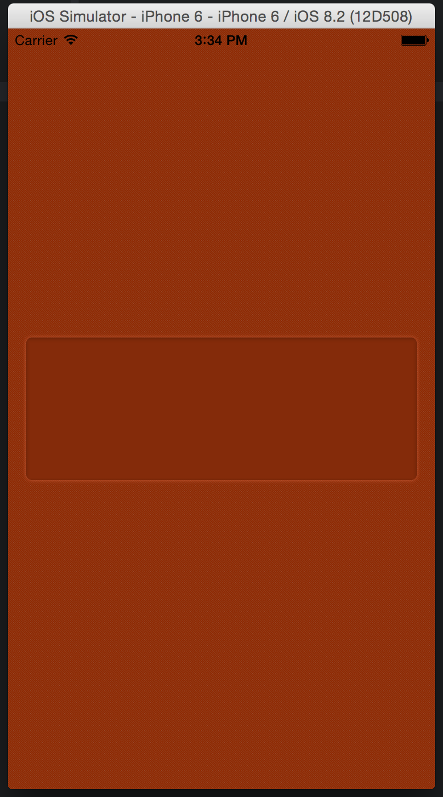

# Fancy Inset View



## Requirements

Requires [YIInnerShadowView](https://github.com/inamiy/YIInnerShadowView) which
is available through cocoapods.

```
platform :ios, '8.0'

pod 'YIInnerShadowView'
```

## Usage

```swift

let view = FancyInsetView(frame: rect)
view.borderRadius = 5.0

// customize inner shadow
view.innerShadow.shadowRadius = 2.0
view.innerShadow.shadowColor = UIColor(white: 4/255.0, alpha: 1.0)
view.innerShadow.shadowOffset = CGSizeMake(0.0, 1.0)
view.innerShadow.shadowOpacity = 0.5

// customize outer shadow
view.layer.shadowRadius = 2.0
view.layer.shadowColor = UIColor(white: 1.0, alpha: 1.0).CGColor
view.layer.shadowOpacity = 1.0
view.layer.shadowOffset = CGSizeMake(0.0, 0.0)

```

## License

FancyInsetView is available under the MIT license. See the LICENSE file for more info.
